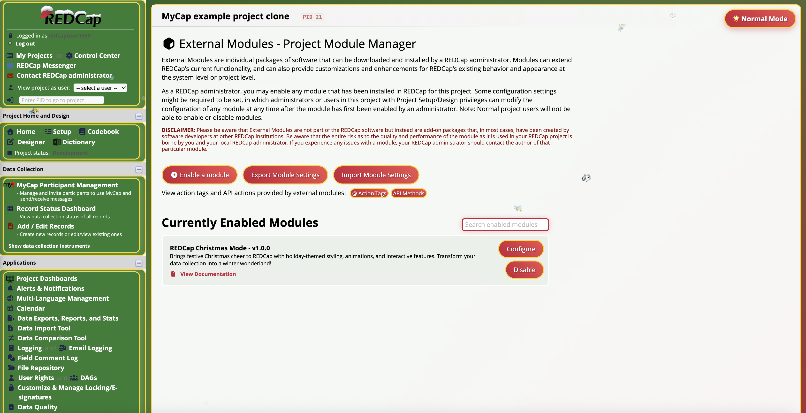

# REDCap Christmas Mode External Module

Transform your REDCap instance into a festive winter wonderland! This external module brings the joy and magic of Christmas to your data collection with rich holiday colors, falling snow, and festive spirit.

*REDCap with Christmas Mode enabled - showcasing the festive holiday theme with falling snow animation and Christmas colors throughout the interface.*

## Features

### 🎄 Visual Themes
- **Christmas Color Palette**: Rich reds, forest greens, golden accents, and snowy whites
- **Holiday Gradients**: Beautiful Christmas-themed gradient backgrounds
- **Seasonal Typography**: Red and green headers with sparkle animations
- **Festive Border Styling**: Gold borders and Christmas-themed decorations

### ❄️ Interactive Elements
- **Falling Snow Animation**: Configurable snowflake effects across all pages
- **Toggle Button**: Easy-to-use Christmas mode on/off switch
- **Holiday Interactions**: Delightful hover effects on buttons and links
- **REDCap Logo Transformation**: Snowy REDCap logo when Christmas mode is active

### 🎁 Customization Options
- **Color Schemes**: Traditional (red/green) or Accessibility-friendly (blue/green)
- **Snow Control**: Enable/disable falling snow animations
- **Project-Level Settings**: Configure Christmas mode per project
- **Global Settings**: System-wide Christmas mode control
- **User Toggle**: Toggle button for users to enable/disable on the fly with local storage

## Installation

1. Copy the `christmas_mode_v1.0.0` folder to your REDCap `modules/` directory
2. Navigate to Control Center > External Modules
3. Enable the "REDCap Christmas Mode" module
4. Configure your preferred settings

## Configuration

### System Settings
- **Enable Christmas Mode globally**: Apply holiday theme to all REDCap pages
- **Allow user toggle**: Let users turn Christmas mode on/off with the toggle button

### Project Settings
- **Enable Christmas Mode for this project**: Project-specific holiday theme
- **Enable falling snow animation**: Add beautiful snowflake fall effects
- **Christmas color scheme**: Choose between Traditional (red/green) or Accessibility-friendly (blue/green) colors

## How It Works

The module uses the `redcap_every_page_top` hook to inject Christmas-themed CSS and JavaScript into every page. It includes:

- CSS variables for consistent holiday theming
- Responsive design that works across all REDCap interfaces
- Local storage to remember user preferences
- Smooth snowflake animations and transitions
- Cross-browser compatibility
- Performance-optimized falling snow
- Automatic REDCap logo replacement with snowy version

## Christmas Theme Features

### 🎨 Color Schemes

**Traditional (Classic Christmas)**
- **Primary Colors**: Christmas red (#c41e3a), forest green (#2e7d32)
- **Accent Colors**: Gold (#ffd700), white, silver (#c0c0c0)
- **Background**: Red and green gradient

**Accessibility-Friendly (Blue Christmas)**
- **Primary Colors**: Deep blue (#2c3e50), forest green (#2e7d32)
- **Accent Colors**: Gold (#ffd700), white, silver (#c0c0c0)
- **Background**: Blue and green gradient

### ❄️ Animations
- **Falling Snow**: Multiple snowflake types (❄ ❅ ❆ ⛄ 🎿) with realistic physics
- **Twinkle Effect**: Headers with gentle sparkle animation using 🎄 emoji
- **Hover Transitions**: Smooth color changes and transforms on interactive elements
- **Gentle Snowfall**: Natural snowflake movement patterns with rotation

## Browser Compatibility

- Chrome/Chromium (recommended)
- Firefox
- Safari
- Edge

## Performance

- Optimized snow animations (4 snowflakes per batch)
- Continuous snowfall with 2-3 second intervals
- Automatic cleanup after 10 seconds per snowflake
- Non-blocking pointer events
- Minimal performance impact on REDCap functionality

## Compatibility

- **REDCap Version**: 8.0.0 or higher
- **PHP Version**: 5.6.0 or higher
- **Framework**: External Modules Framework v15

## Changelog

### Version 1.0.0
- Initial release with full Christmas theming
- Falling snow animations with multiple snowflake types (❄ ❅ ❆ ⛄ 🎿)
- Two color schemes: Traditional (red/green) and Accessibility-friendly (blue/green)
- Toggle functionality with local storage persistence
- Automatic REDCap logo replacement with snowy version
- Performance optimizations for smooth animations
- Global and project-level configuration options

## Support

For questions, bug reports, or feature requests, please contact your REDCap administrator.

## License

This module is licensed under the MIT License. See the [LICENSE](LICENSE) file for details.

This module is provided as-is for educational and festive purposes. Merry Christmas! 🎄

---

*May your data be merry and your surveys bright, and may all your REDCap projects be filled with holiday delight!* ❄️🎅
